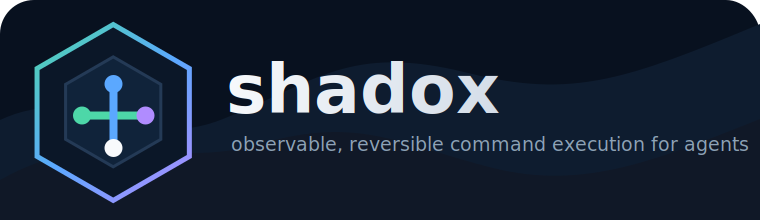
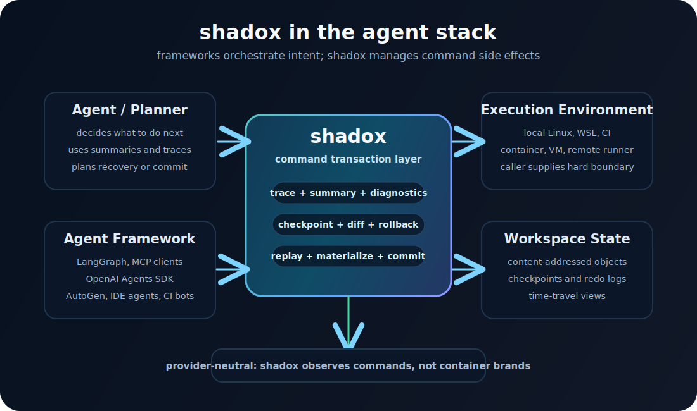

<p align="center">
  
</p>

<p align="center">
  <a href="https://github.com/wotchin/shadox/actions/workflows/ci.yml"></a>
  
  
  
  
</p>

<p align="center">
  <strong>Observable, reversible command execution for agents.</strong>
</p>

`shadox` is an agent runtime control plane. It sits between an agent framework and the real execution environment, turning risky shell commands into inspectable transactions with traces, summaries, checkpoints, rollback, replay, and recovery state.

It is not an agent framework, not a container runtime, and not a hardened security boundary by itself. Agent frameworks orchestrate intent; shadox manages command side effects.

<p align="center">
  
</p>

## Why Shadox

Agents increasingly write code, run tests, format files, generate assets, and execute migrations. The hard part is not just running a command; it is knowing what happened after the command changed the workspace.

Shadox gives agents a stable execution contract:

- **Observe** every run through JSONL trace events and a final JSON summary.
- **Explain** the effective execution policy before a command runs.
- **Recover** from failed or risky commands with checkpoint, diff, rollback, replay, and materialize.
- **Diagnose** timeouts, non-zero exits, likely Landlock/seccomp denials, signals, and OOM-like failures.
- **Discover** usage through `shadox agent-guide` and `shadox capabilities`, without vendor-specific skill folders.
- **Compose** with any caller-provided isolation boundary while staying provider-neutral.

## Quick Start

```bash
cargo build

shadox check-env --json
shadox agent-guide --format markdown
shadox capabilities --format json

shadox run \
  --profile workspace-write \
  --allow-write . \
  --versioned-workspace . \
  --rollback-on-failure \
  --summary .shadox/last-summary.json \
  --trace .shadox/last-trace.jsonl \
  -- cargo test
```

By default, runs write:

```text
.shadox/runs/<timestamp>-<run_id>/trace.jsonl
.shadox/runs/<timestamp>-<run_id>/summary.json
```

Pass `--trace -` to stream JSONL events to stdout. When streaming, the final pretty summary is written to stderr so stdout remains a pure JSONL event stream.

## Agent Integration

The primary integration surface is the CLI. Any framework that can run a command can use shadox.

```text
Agent / planner
  -> LangGraph, OpenAI Agents SDK, AutoGen, IDE agent, CI bot, or custom loop
  -> shadox run -- ...
  -> local shell, WSL, CI runner, container, VM, or remote environment
```

Recommended pattern:

```bash
shadox run \
  --profile workspace-write \
  --allow-write . \
  --versioned-workspace . \
  --rollback-on-failure \
  --summary .shadox/last-summary.json \
  --trace .shadox/last-trace.jsonl \
  -- <command>
```

After the command exits, the agent should read `summary.json` instead of inferring state from stdout.

| Ecosystem | Use shadox as |
| --- | --- |
| LangGraph | A tool node that wraps shell commands and stores `summary.json` in graph state. |
| OpenAI Agents SDK | An MCP tool surface or small function tool backed by the CLI. |
| AutoGen | A code executor wrapper around `shadox run`. |
| IDE agents | A safer shell execution path for edits, tests, formatters, and generators. |
| CI agents | A transaction log and recovery surface for automated changes. |
| Custom agents | A process boundary with stable JSON trace and summary contracts. |

See [Ecosystem Positioning](docs/ecosystem-positioning.md) for the full integration model.

## Core Commands

```bash
# Discover the runtime contract
shadox agent-guide --format markdown
shadox capabilities --format json

# Inspect the effective policy before running
shadox explain --profile workspace-write --allow-write . -- cargo test

# Run an observable, recoverable command
shadox run --versioned-workspace . --rollback-on-failure -- cargo test

# Inspect and recover workspace state
shadox fs status .
shadox fs log .
shadox fs diff <checkpoint_a> <checkpoint_b> --workspace .
shadox fs rollback <checkpoint_id> --workspace .
shadox fs materialize <checkpoint_id> ./historical-view --workspace .
shadox fs replay <run_id> ./replayed-view --workspace . --until-seq 3
```

## Versioned Workspace

With `--versioned-workspace`, shadox turns a command into a workspace transaction:

1. checkpoint before command
2. command execution with trace capture
3. checkpoint after command
4. structured diff and redo journal
5. rollback on failure when requested
6. commit on success when requested

```bash
shadox run \
  --profile workspace-write \
  --allow-write . \
  --versioned-workspace . \
  --rollback-on-failure \
  --commit-on-success \
  -- cargo test
```

The summary includes an `fs` block with `checkpoint_before`, `checkpoint_after`, `changed_files`, `changes`, `journal_path`, `committed`, and `rolled_back`.

Replay commands accept `--until-seq` and `--until-ts`, so agents can materialize a historical view without mutating the live workspace. `op-restore` can apply operation replay back to the live workspace when the user wants an actual rollback to an event boundary or timestamp.

```bash
shadox fs op-journal <run_id> --workspace .
shadox fs op-replay <run_id> ./operation-view --workspace . --until-seq 3
shadox fs op-restore <run_id> --workspace . --until-ts 1790000000000
```

For the detailed design, see [Versioned Workspace Design](docs/versioned-workspace.md).

## Execution Model

The built-in Linux path uses native enforcement primitives:

- `no_new_privs`
- rlimits
- Landlock filesystem restrictions
- a basic seccomp blocklist

These are useful for least-privilege developer workflows and policy diagnostics, but shadox should not be presented as a hardened multi-tenant isolation boundary. If a workload needs hardened isolation, the caller should supply that boundary outside the shadox contract, such as a trusted container, VM, remote runner, or dedicated sandbox.

Shadox stays provider-neutral: it does not need provider-specific CLI switches to remain useful. The universal interface is ordinary command execution plus trace, summary, diagnostics, checkpoint, rollback, replay, and materialize.

## Trace And Summary

Each JSONL trace event uses a stable envelope:

```json
{
  "schema_version": 1,
  "shadox_version": "0.1.0",
  "profile": "agent-default",
  "profile_version": 1,
  "ts": 1790000000000,
  "seq": 1,
  "run_id": "00000000-0000-0000-0000-000000000000",
  "kind": "process.spawn",
  "pid": 1234,
  "level": "info",
  "data": {}
}
```

`summary.json` includes process result, failure classification, resource usage, output tails, diagnostics, observer findings, and optional versioned workspace state. The top-level schema fields let agents consume reports with explicit compatibility checks.

## Programmable Observation

Rhai scripts can define an `on_event(event)` hook. The hook cannot mutate isolation policy in v1; it only emits findings.

```rhai
fn on_event(event) {
    if event.kind == "stderr.chunk" {
        return #{
            message: "process wrote to stderr",
            severity: "warn",
            tags: ["stderr"]
        };
    }
}
```

## Status

Shadox is a research-oriented project that is ready for controlled developer workflows and internal agent execution experiments. Treat the recovery and observability contracts as the core product surface. Treat hardened isolation as caller-supplied infrastructure.

`shadox run` expects Linux with procfs. The project builds on non-Linux hosts, but command execution is Linux-only.

## Docs

- [Agent Contract](docs/agent-contract.md)
- [Ecosystem Positioning](docs/ecosystem-positioning.md)
- [Versioned Workspace Design](docs/versioned-workspace.md)
- [Agent Capabilities JSON](docs/agent-capabilities.json)

## License

Apache-2.0
